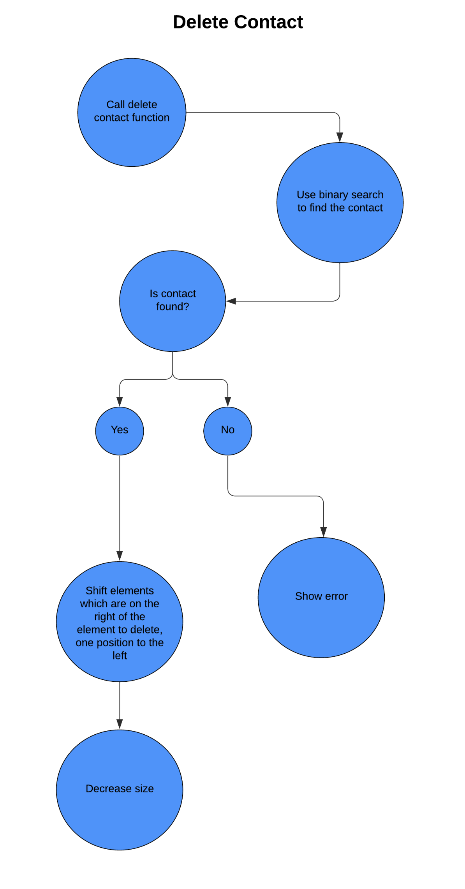

 ## Overview

This Phonebook application allows the user to add, remove, view and search for contacts providing a centralised system to store and access contacts, without the need for physical records and allowing the user to efficiently sort through the database of contacts.
It is possible to add a contact by providing a name, a phone number, and optionally an email and an address. A contact can be removed by providing an existing name in the phonebook.
The user can search for a specific contact, or view all contacts present in the phonebook, displaying them in alphabetical order.

The application is implemented in Python with a basic Graphical User Interface (GUI) using the `tkinter` library which is included in most Python installations.

The code is presented using Jupyter Notebook and is split into different sections with the core application code, example use cases, the GUI and the unit tests, with each being runnable directly from the notebook.

## Implementation

The application is implemented in Python with a basic Graphical User Interface (GUI), using a `Contact` class to represent a contact and a `Phonebook` class to represent the phonebook.

The `Phonebook` class has a `contacts` attribute, which is an array that contains `Contact` objects.

The `Contact` class is designed with each contact stored as a name and phone number pair, with the option of adding an email address. Each attribute is stored as a string.

The application provides the following functionalities:

- `Add a contact`: the user can add a contact by providing a name, a phone number, and optionally an email and address.
  If a contact with the same name already exists, an error message is displayed.

- `Remove a contact`: the user can remove a contact by providing the name of an existing contact.
  If the contact does not exist, an error message is displayed.

- `View all contacts`: the user can view all contacts present in the phonebook, displaying their name, phone number, email, and address in alphabetical order.
  This is always kept in alphabetical order also when adding or removing contacts.

- `Search for a contact`: the user can search for a specific contact by providing the name.
  If the contact exists, its details are displayed (name, phone number, email, and address).

- `Print Contact`: the application also provides a print contact function which will print to the screen all of the fields of a contact.
  This is used to display the contact details in the GUI.

The application is implemented in an object-oriented manner, with separate classes for contacts and the phonebook, providing a clean and modular design. The code is fully commented to explain the purpose of each function and class.

## Algorithm Design

`Retrieving a contact`
The contacts are retrieved by employing binary search to look through the ordered array of contacts, using as a function parameter the name inserted by the user. Then two pointers will be created: a ‘left’ one which will be set to 0, and a ‘right’ one which will point to the last element of the array.
The algorithm will then find the mid point of the two pointers, and check if the mid point is greater than or less than the midpoint. If the midpoint is greater than the search value, then the other half of the array can be discarded.

`Creating a contact`
When a new contact is added, as a binary search function is used, it is important that said contact is added in the correct sort order. The first step for inserting, is to search the list to find the correct position for the new entry, and then shift every subsequent element one position to the right before inserting the new element at the desired position.

`Removing a contact`
The algorithm for removing a contact is similar to the one for adding one, it is slightly more complicated due to the requirement that the list of contacts is always sorted.
In order to delete a contact it is first needed to find said item, by taking the name as an input to the function and then using the previously defined binary search function to find the item efficiently. If the item is not present an error can be returned, otherwise the entry can be removed from the list of contacts by shifting every subsequent.

## Testing

The application has been manually tested throughout development and also unit tested using the `unittest` module in Python, which allows for the creation of test cases to verify each function of the application with both the positive and error cases being covered by tests.
The unit tests cover all the cases mentioned in the original test plan and expand on it by including the adding and deleting functions.

